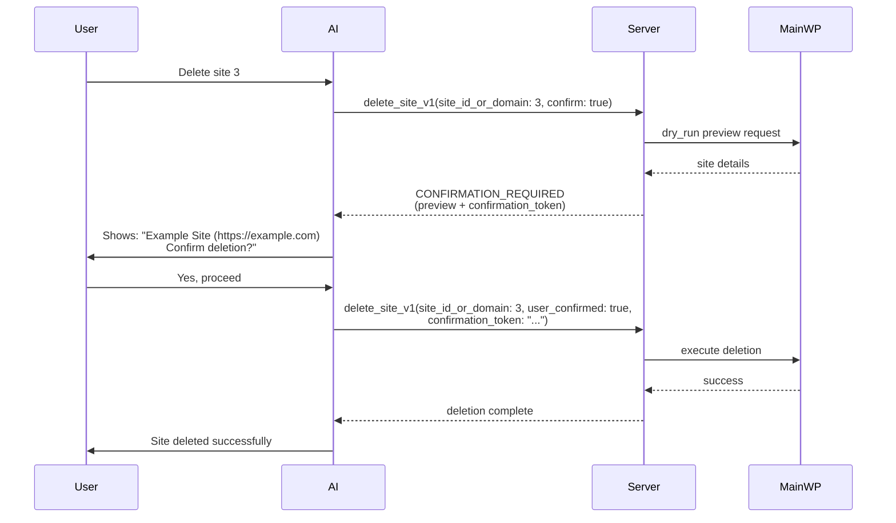

The MCP server assumes the AI will sometimes get things wrong. The guardrails are built so that the worst outcome of a misunderstood prompt is a refused request.

## What the AI can and cannot do

The AI operates with the permissions of the WordPress user whose Application Password you configured, and only through the tools the server exposes.

With default configuration it **can**: read site, plugin, theme, update, client, and tag data; run updates; activate and deactivate plugins and themes; sync and reconnect sites; and delete sites, clients, tags, plugins, or themes, but only after you confirm.

It **cannot**: log into WordPress admin, bypass WordPress permissions, run arbitrary code on your sites, or touch anything MainWP itself does not expose.

## Deletions require your approval

Destructive operations use a two-step flow. Asking the AI to delete something does not delete it; it produces a preview.

1. **Preview.** The server intercepts the request, runs a dry run, and returns what would be affected along with a one-time confirmation token. The AI shows you the preview.
2. **Execute.** Only after you say yes does the AI send the confirmation. The server checks that the token matches the same operation with the same arguments and that the preview is less than 5 minutes old, then executes.




The gate is strict. A destructive call with no confirmation parameters is rejected outright; the server never executes a bare destructive request. Operations that cannot produce a preview still go through the same token gate, and the AI must describe what will happen and get your explicit approval first.

This applies to every tool the server classifies as destructive, including `delete_site_v1`, `delete_client_v1`, `delete_tag_v1`, `delete_site_plugins_v1`, and `delete_site_themes_v1`. An ability that does not explicitly declare itself non-destructive is treated as destructive and gated the same way.

For unattended automation where you have already verified the targets, the flow can be disabled with `requireUserConfirmation: false`. See [Configuration Reference](/mcp-server/reference/configuration).

## Safe mode: block deletions entirely

If you want destructive operations off the table completely, enable safe mode:

```json
{
  "safeMode": true
}
```

Destructive calls then fail with `SAFE_MODE_BLOCKED` without ever reaching your Dashboard. We recommend running your first sessions in safe mode: you can verify the connection and learn how the AI behaves while the dangerous tool classes stay blocked.

<Warning>
Safe mode is not read-only. Updates, plugin and theme activation, and site syncing still work, and a bad update can break a site. For genuinely read-only access, expose only read tools with `allowedTools`. The [Restrict Available Tools](/mcp-server/guides/restrict-tools) guide has a ready-made read-only configuration.
</Warning>

| | Safe mode | Confirmation flow |
| --- | --- | --- |
| Purpose | Block all destructive operations | Allow them with your approval |
| Good for | Testing, demos, training, first-time setup | Day-to-day production use |
| Deletions | Blocked | Allowed after preview and confirmation |
| You experience | AI says "I can't do that" | AI shows a preview and asks |
| Default | Off | On |

When both are configured, safe mode wins.

## One honest caveat: the AI client has the last word

The server marks dangerous tools, instructs the AI to preview before executing, and refuses calls that skip the flow. But the AI client decides how to present all of this to you. A flawed client could misread your "hmm, maybe" as a yes, or claim you confirmed when you did not.

The server-side gates above cannot be talked around: a deletion without a valid token does not execute. If you do not trust the AI client in front of them, add layers it cannot see past:

- **Safe mode** blocks destructive execution at the server.
- **`blockedTools`** removes dangerous tools from the AI's view entirely, so there is nothing to misuse.

```json
{
  "safeMode": true,
  "blockedTools": [
    "delete_site_v1",
    "delete_client_v1",
    "delete_tag_v1",
    "delete_site_plugins_v1",
    "delete_site_themes_v1"
  ]
}
```

## Going further

<CardGroup cols={2}>
  <Card title="Restrict Available Tools" icon="filter" href="/mcp-server/guides/restrict-tools">
    Read-only setups, update-only setups, and hiding destructive tools.
  </Card>
  <Card title="Security Model" icon="lock" href="/mcp-server/reference/security">
    Trust boundaries, credential handling, logging, and the pre-production checklist.
  </Card>
</CardGroup>
